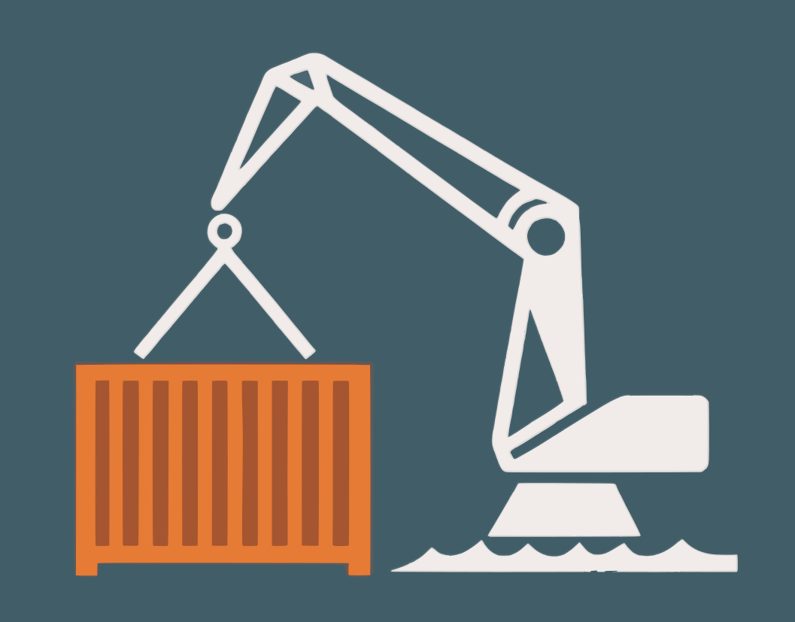

# Crane Autoscaler for Kubernetes

Use both vertical and horizontal pod autoscaler on the same set of resources.
This operator prevents the two autoscalers from fighting each other by enabling only one at a time.



----

## Description

Crane Autoscaler is a Kubernetes operator that manages both a Vertical Pod Autoscaler (VPA) and a Horizontal Pod Autoscaler (HPA) for the same workload through a single `CranePodAutoscaler` custom resource.

It solves the problem that VPA and HPA cannot be used together on the same workload because they would conflict with each other. Crane Autoscaler enables only one at a time and switches between them based on a configurable capacity threshold:

- **VPA-active mode**: The VPA scales resources vertically. When the VPA recommendation reaches a configured percentage (`vpaCapacityThresholdPercent`) of its upper bound, the operator switches to HPA.
- **HPA-active mode**: The HPA scales horizontally. When the HPA has scaled back down to its minimum replicas and the VPA recommendation drops below the threshold, the operator switches back to VPA.

## Getting Started

### Prerequisites
- go version v1.25.0+
- docker version 17.03+.
- kubectl version v1.28+.
- Access to a Kubernetes v1.28+ cluster.

### To Deploy on the cluster
**Build and push your image to the location specified by `IMG`:**

```sh
make docker-build docker-push IMG=<your-registry>/crane-autoscaler:<tag>
```

**NOTE:** Replace `<your-registry>` and `<tag>` with your container registry and desired image tag.
Make sure you have push access to the registry and that your cluster can pull from it.

**Install the CRDs into the cluster:**

```sh
make install
```

**Deploy the Manager to the cluster with the image specified by `IMG`:**

```sh
make deploy IMG=<your-registry>/crane-autoscaler:<tag>
```

> **NOTE**: If you encounter RBAC errors, you may need to grant yourself cluster-admin
privileges or be logged in as admin.

**Create instances of your solution**
You can apply the samples (examples) from the config/sample:

```sh
kubectl apply -k config/samples/
```

>**NOTE**: Ensure that the samples has default values to test it out.

### To Uninstall
**Delete the instances (CRs) from the cluster:**

```sh
kubectl delete -k config/samples/
```

**Delete the APIs(CRDs) from the cluster:**

```sh
make uninstall
```

**UnDeploy the controller from the cluster:**

```sh
make undeploy
```

## Project Distribution

Following are the steps to build the installer and distribute this project to users.

1. Build the installer for the image built and published in the registry:

```sh
make build-installer IMG=<your-registry>/crane-autoscaler:<tag>
```

NOTE: The makefile target mentioned above generates an 'install.yaml'
file in the dist directory. This file contains all the resources built
with Kustomize, which are necessary to install this project without
its dependencies.

2. Using the installer

Users can just run kubectl apply -f <URL for YAML BUNDLE> to install the project, i.e.:

```sh
kubectl apply -f https://raw.githubusercontent.com/phihos/crane-autoscaler/<tag or branch>/dist/install.yaml
```

## Contributing

Contributions are welcome. Please open an issue or pull request on GitHub.

Run `make help` to see all available `make` targets.

## License

Copyright 2024.

Licensed under the Apache License, Version 2.0 (the "License");
you may not use this file except in compliance with the License.
You may obtain a copy of the License at

    http://www.apache.org/licenses/LICENSE-2.0

Unless required by applicable law or agreed to in writing, software
distributed under the License is distributed on an "AS IS" BASIS,
WITHOUT WARRANTIES OR CONDITIONS OF ANY KIND, either express or implied.
See the License for the specific language governing permissions and
limitations under the License.

